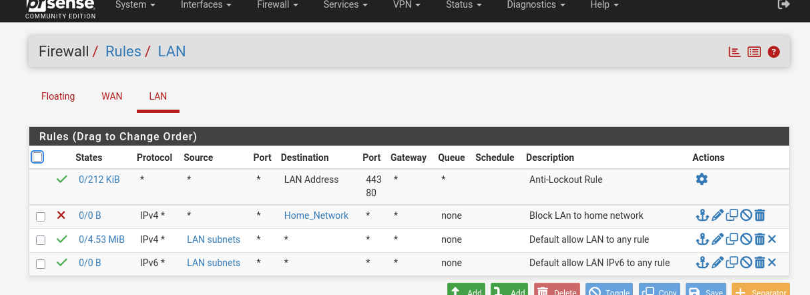
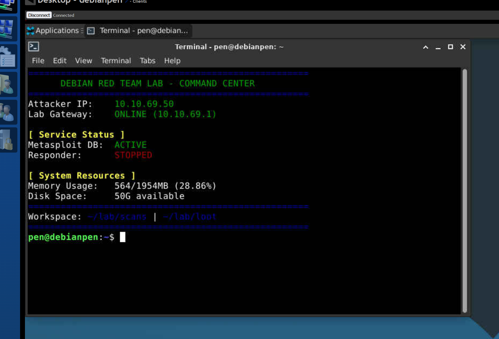
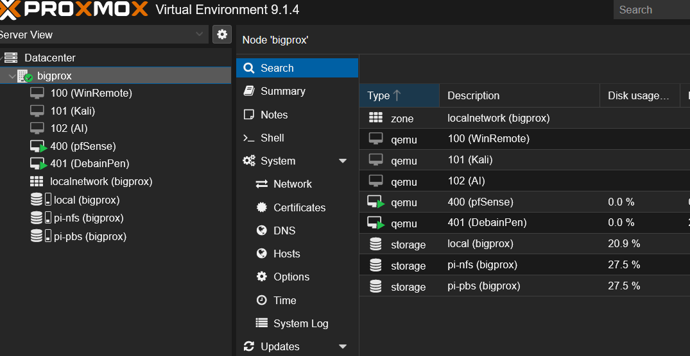

# Multi-Layered Virtual Research Environment & Offensive Security Lab

## 📋 Project Executive Summary
**Objective:** To architect and deploy a fully isolated, software-defined data center (SDDC) environment for controlled security research, vulnerability assessment, and offensive security testing.

**The Challenge:** Standard home lab environments often lack adequate network segmentation, creating a risk of "lab escape" where exploits or automated malware could potentially impact a production home network.

**The Solution:** Using **Proxmox VE** as a Type-1 Hypervisor, I implemented a "Walled Garden" architecture. The core of the infrastructure is a **pfSense** virtual firewall providing strict egress filtering and network address translation (NAT). This ensures that while the lab can reach the internet for critical updates, it remains entirely invisible to the host network.

---

## 🛠️ Tech Stack
* **Hypervisor:** Proxmox VE 8.x
* **Firewall/Routing:** pfSense (Virtual Appliance)
* **Attacker Node:** Debian 13 "Surgical" Build (Minimal XFCE)
* **Remote Management:** MeshCentral (Encrypted Out-of-Band Access)
* **Security Stack:** Metasploit Framework, Responder, Nmap, PostgreSQL, ExploitDB

---

## 🌐 Network Architecture & Security Controls
The lab is designed with a strict "deny-by-default" egress policy to maintain total isolation from the physical LAN.

### IP Schema
| Segment | Range | Purpose |
| :--- | :--- | :--- |
| **Lab LAN** | `10.10.69.0/24` | Primary Research Network |
| **Gateway** | `10.10.69.1` | pfSense Virtual Interface |
| **Management** | `10.10.69.x` | Attacker/Jump-box Node |

### Key Isolation Features
* **Egress Filtering:** Custom pfSense firewall rules block all traffic destined for the `192.168.x.x` home network.
* **NAT Logic:** All lab traffic is translated through the pfSense WAN, preventing the home router from "seeing" internal lab devices.
* **Virtual Switching:** Leveraged Proxmox `vmbr` bridges to simulate physical hardware isolation.

---

## 🚀 The "Surgical" Attacker Build (Debian 13)
Rather than using a pre-packaged distribution, I manually constructed a "Surgical" Debian 13 node. This approach maximizes system performance and ensures a deep understanding of tool dependencies.

### Custom Command Center
I developed a custom Bash orchestration script (`welcome.sh`) that triggers upon login to provide real-time environment intelligence:
* **Service Monitoring:** Tracks status of PostgreSQL (Metasploit DB) and Responder processes.
* **Network Awareness:** Displays current Attacker IP and Gateway reachability.
* **Resource Tracking:** Real-time RAM and Disk utilization to monitor VM health.

---

## 📸 Proof of Concept
*(Note: Upload your screenshots to an `/images` folder in this repo and update the links below!)*

### 1. pfSense Isolation Rule

*Description: Firewall rule explicitly blocking traffic from the Lab LAN to the Home Network Alias.*

### 2. Custom Command Center Dashboard

*Description: The custom welcome script providing a high-level overview of the attacker node's status.*

### 3. Proxmox Infrastructure View

*Description: High-level view of the virtualized infrastructure in Proxmox.*

---

## 📈 Future Roadmap
- [ ] Deployment of a Windows Server 2022 Active Directory Lab.
- [ ] Integration of a Wazuh SIEM node for defensive monitoring.
- [ ] Automated log ingestion from pfSense into an ELK stack.
