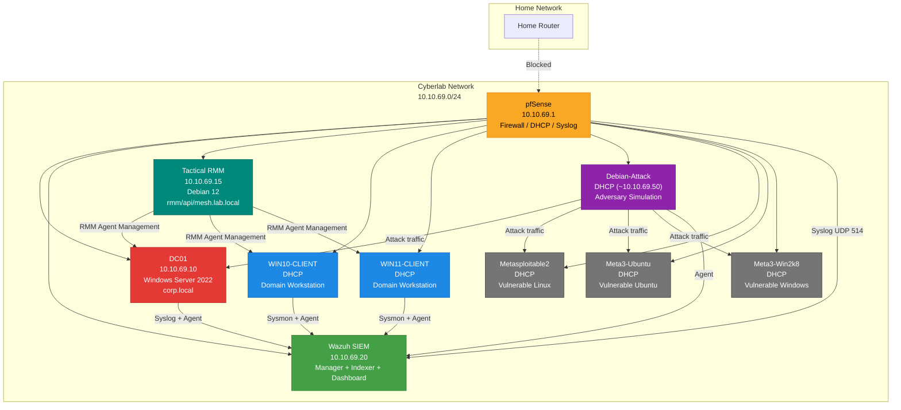

# Lab Architecture & Network Segmentation

## Overview
This homelab is designed as an **isolated cybersecurity environment** for practicing detection engineering, incident response, and adversary emulation.
All lab systems are segmented from the home network using pfSense.

---

## Network Layout

**Cyberlab Network:** `10.10.69.0/24`

| Component | IP Address | Notes |
|---|---|---|
| pfSense | 10.10.69.1 | Default gateway, firewall, DHCP |
| DC01 (Domain Controller) | 10.10.69.10 | Windows Server 2022, corp.local |
| Wazuh SIEM | 10.10.69.20 | Centralized log collection & alerting |
| Tactical RMM | 10.10.69.15 | Internal RMM platform on Debian 12; rmm.lab.local / api.lab.local / mesh.lab.local |
| WIN10-CLIENT | DHCP | Domain-joined workstation |
| WIN11-CLIENT | DHCP | Domain-joined workstation |
| Debian-Attack | DHCP | Adversary simulation tools |
| Metasploitable2 | DHCP | Vulnerable Linux target |
| Metasploitable3-Ubuntu | DHCP | Vulnerable Ubuntu target |
| Metasploitable3-Win2k8 | DHCP | Vulnerable Windows target |

---

## Logical Diagram (Text)

[ Home Network ]
|
| (Blocked by Firewall Rules)
|
[ pfSense ]
10.10.69.1
|
+---------------- Cyberlab Network (10.10.69.0/24) ----------------+
| |
[ Attack VM ] [ WIN10-CL ] [ WIN11-CL ] [ DC01 ] [ Wazuh ] [ Tactical RMM ] [ Meta2 ] [ Meta3 ]
 (DHCP) (DHCP) (DHCP) (Static) (Static) (10.10.69.15) (DHCP) (DHCP)

---

## Network Topology (Mermaid)

> **Note:** The Mermaid diagram renders visually on GitHub. Dashed lines represent blocked traffic; solid lines show allowed communication paths. Color coding: 🟡 Firewall, 🔴 Server, 🟢 SIEM, 🟩 RMM, 🔵 Workstations, 🟣 Attack host, ⚫ Vulnerable targets.

---

## Segmentation & Security Controls

- Cyberlab network is **fully segmented** from the home network
- pfSense firewall rules:
  - Block inbound traffic from home → lab
  - Block outbound traffic from lab → home
  - Allow controlled internal lab communication
- DHCP is used for most lab VMs to simulate real enterprise environments
- Static addressing reserved for infrastructure services (pfSense, AD, SIEM)

---

## Design Rationale

- **Isolation:** Prevents accidental impact on production/home systems
- **Realism:** Mirrors enterprise network segmentation
- **Telemetry:** Enables realistic firewall + host-level logs
- **Detection:** Supports attack → firewall log → SIEM alert workflows

This architecture supports both **offensive testing** and **defensive monitoring** within a controlled environment.
